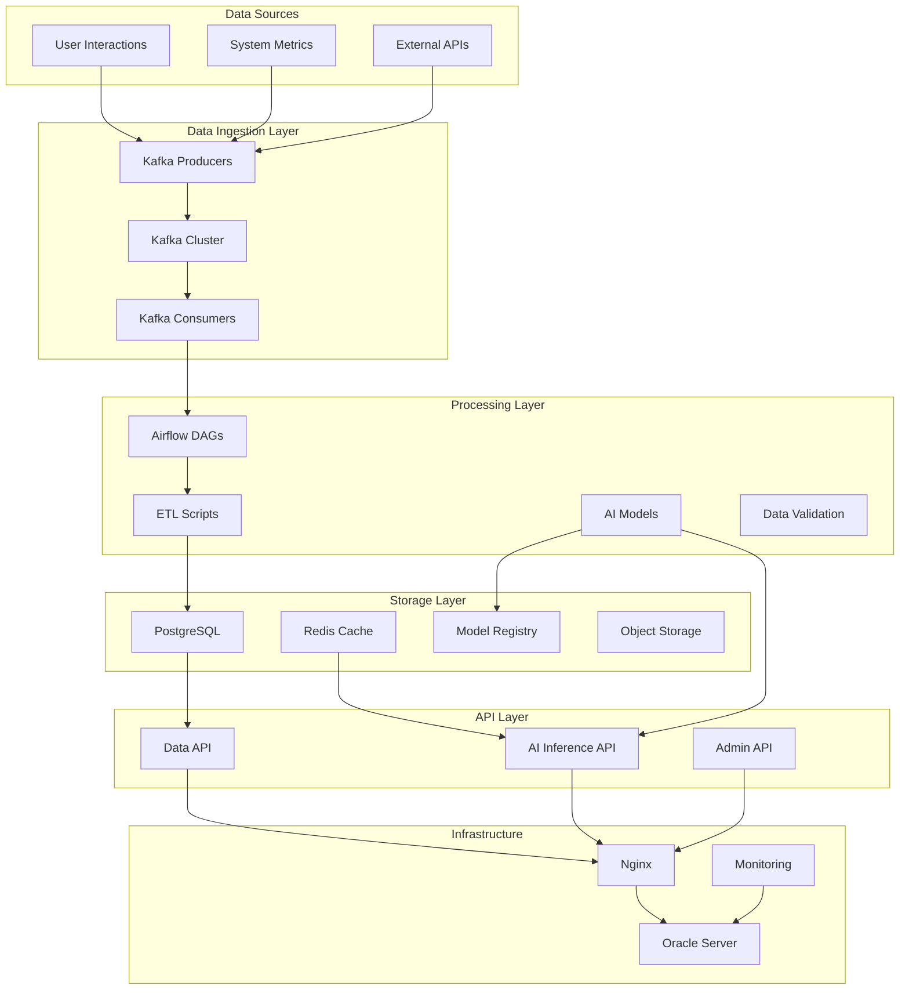

# OKR Project - System Architecture

## Overview

The OKR Project is designed as a modern, scalable system that combines AI/ML capabilities with robust data engineering practices. This document outlines the system architecture, component interactions, and design decisions.

## High-Level Architecture



## Component Details

### 1. Data Ingestion Layer

**Kafka Cluster**
- **Purpose**: Real-time data streaming and event processing
- **Topics**:
  - `okr_ai_predictions`: AI model predictions and results
  - `okr_system_metrics`: System performance and health metrics
  - `okr_user_events`: User interaction events
  - `okr_data_pipeline`: ETL pipeline status and logs

**Kafka Producers**
- Located in `data/kafka/producers/`
- Responsible for publishing events to appropriate topics
- Implements error handling and retry logic

**Kafka Consumers**
- Located in `data/kafka/consumers/`
- Process messages from topics
- Trigger downstream processing workflows

### 2. Processing Layer

**Apache Airflow**
- **Purpose**: Workflow orchestration and ETL pipeline management
- **DAGs Location**: `data/airflow_dags/`
- **Key DAGs**:
  - `okr_etl_dag.py`: Main ETL pipeline
  - `model_training_dag.py`: ML model training workflows
  - `data_quality_dag.py`: Data validation and quality checks

**AI/ML Components**
- **Training Pipeline**: `ai/src/training/`
  - Model development and training scripts
  - Hyperparameter tuning
  - Model validation and testing
- **Inference Pipeline**: `ai/src/inference/`
  - Real-time model serving via FastAPI
  - Batch prediction capabilities
  - Model versioning and A/B testing

### 3. Storage Layer

**PostgreSQL Database**
- **Primary Database**: User data, OKR records, system configuration
- **Data Warehouse**: Processed analytics data, aggregated metrics
- **Schema**:
  ```sql
  -- Users table
  CREATE TABLE users (
      user_id UUID PRIMARY KEY,
      name VARCHAR(255) NOT NULL,
      email VARCHAR(255) UNIQUE NOT NULL,
      created_at TIMESTAMP DEFAULT NOW(),
      updated_at TIMESTAMP DEFAULT NOW()
  );
  
  -- OKRs table
  CREATE TABLE okrs (
      okr_id UUID PRIMARY KEY,
      user_id UUID REFERENCES users(user_id),
      objective TEXT NOT NULL,
      key_result TEXT NOT NULL,
      progress DECIMAL(3,2) DEFAULT 0.0,
      status VARCHAR(50) DEFAULT 'not_started',
      created_at TIMESTAMP DEFAULT NOW(),
      updated_at TIMESTAMP DEFAULT NOW()
  );
  ```

**Redis Cache**
- **Purpose**: Session management, API response caching, real-time data
- **Use Cases**:
  - Model prediction caching
  - User session storage
  - Rate limiting
  - Real-time metrics

**Model Registry**
- **Purpose**: Versioned storage of trained ML models
- **Features**:
  - Model versioning
  - Metadata tracking
  - Model promotion workflows
  - Performance monitoring

### 4. API Layer

**AI Inference API** (`ai/src/inference/main.py`)
- **Framework**: FastAPI
- **Endpoints**:
  - `POST /predict`: Model predictions
  - `GET /models`: List available models
  - `POST /models/{model_name}/load`: Load model
  - `GET /health`: Health check

**Data API**
- **Purpose**: Data access and analytics endpoints
- **Features**:
  - User metrics retrieval
  - OKR progress tracking
  - System health monitoring

### 5. Infrastructure Layer

**Nginx Web Server**
- **Configuration**: `infra/nginx/`
- **Features**:
  - Reverse proxy for API services
  - Load balancing
  - SSL termination
  - Static file serving

**Oracle Server Deployment**
- **Scripts**: `infra/oracle/`
- **Components**:
  - Application deployment scripts
  - Service management (systemd)
  - Environment configuration
  - Health checks

## Data Flow

### 1. Real-time Data Flow
```
User Action → Kafka Producer → Kafka Topic → Kafka Consumer → Database
```

### 2. ETL Pipeline Flow
```
Source Data → Airflow DAG → Extract → Transform → Load → Validate → Store
```

### 3. AI Prediction Flow
```
Input Data → AI API → Model Inference → Result → Cache → Response
```

## Security Considerations

### Authentication & Authorization
- JWT-based authentication for API access
- Role-based access control (RBAC)
- API key management for service-to-service communication

### Data Security
- Encryption at rest for sensitive data
- TLS encryption for data in transit
- Regular security audits and vulnerability scanning

### Infrastructure Security
- Network segmentation
- Firewall configuration
- Regular security updates
- Monitoring and alerting

## Scalability Considerations

### Horizontal Scaling
- Kafka cluster can be scaled by adding brokers
- API services can be scaled with load balancers
- Database read replicas for read-heavy workloads

### Vertical Scaling
- AI inference servers can be upgraded for better performance
- Database servers can be scaled for larger datasets

### Performance Optimization
- Database indexing strategy
- Caching layers for frequent queries
- Asynchronous processing for long-running tasks

## Monitoring and Observability

### Metrics Collection
- **Application Metrics**: API response times, error rates, throughput
- **Infrastructure Metrics**: CPU, memory, disk, network usage
- **Business Metrics**: OKR completion rates, user engagement

### Logging Strategy
- **Centralized Logging**: All services log to centralized system
- **Log Levels**: DEBUG, INFO, WARN, ERROR, FATAL
- **Structured Logging**: JSON format for easy parsing

### Alerting
- **Threshold Alerts**: CPU > 80%, Memory > 85%, Disk > 90%
- **Error Rate Alerts**: API error rate > 5%
- **Business Alerts**: Data pipeline failures, model performance degradation

## Deployment Strategy

### Environment Structure
- **Development**: Local development and testing
- **Staging**: Pre-production testing environment
- **Production**: Live production system

### CI/CD Pipeline
1. **Code Commit**: Developer pushes code to repository
2. **CI Pipeline**: Automated testing, linting, security scans
3. **Build**: Create deployment artifacts
4. **Deploy**: Automated deployment to target environment
5. **Validation**: Post-deployment health checks

### Rollback Strategy
- **Blue-Green Deployment**: Maintain two identical production environments
- **Database Migrations**: Reversible migration scripts
- **Model Rollback**: Previous model versions available for quick rollback

## Future Enhancements

### Short-term (3-6 months)
- Advanced model monitoring and drift detection
- Real-time dashboards for business metrics
- Enhanced data quality monitoring

### Medium-term (6-12 months)
- Multi-region deployment for global scale
- Advanced AI features (NLP, recommendation systems)
- Mobile application support

### Long-term (1+ years)
- Machine learning automation (MLOps)
- Advanced analytics and reporting
- Integration with external business systems

## Technology Stack Summary

| Component | Technology | Purpose |
|-----------|------------|---------|
| API Framework | FastAPI | REST API development |
| Message Queue | Apache Kafka | Real-time data streaming |
| Workflow Management | Apache Airflow | ETL orchestration |
| Database | PostgreSQL | Primary data storage |
| Cache | Redis | Session and response caching |
| ML Framework | PyTorch/TensorFlow | Model development |
| Web Server | Nginx | Reverse proxy and load balancing |
| Monitoring | Prometheus/Grafana | System monitoring |
| Testing | pytest | Unit and integration testing |
| CI/CD | GitHub Actions | Automated deployment |